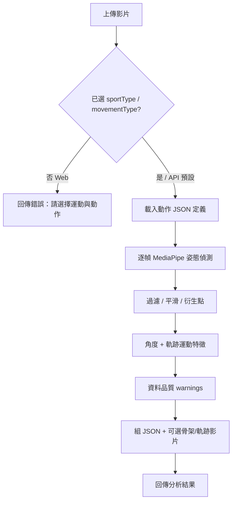

# 運動動作分析 — 現有功能與流程重點

> 文件依據：schemaVersion **1.0** 程式現況整理。  
> 系統定位：**客觀姿態量測**（節點／角度／軌跡），**不評價動作品質**，也**不會自動辨識影片屬於哪一種動作**。

---

## 一、系統定位與架構

| 項目 | 說明 |
|------|------|
| 產品目標 | 上傳運動影片 → 輸出人體節點、關節角度、軌跡運動與資料品質警告 |
| 不做的事 | 動作自動分類、動作品質評分、好壞判斷、建議改正 |
| 前端 | C# ASP.NET Core MVC（`MotionAnalysis.Web`），頁面 `/Pose/Index` |
| 後端分析 | Python FastAPI（`pose-api`），MediaPipe Pose Detection |
| 契約版本 | `schemaVersion: 1.0` |

```text
使用者（瀏覽器）
    │  上傳影片 + 選動作／角度／慣用側
    ▼
MotionAnalysis.Web（PoseController）
    │  multipart → PoseApiClient
    ▼
pose-api（POST /analyze/video）
    │  AnalysisPipeline.run(...)
    ▼
結果 JSON + 可選骨架／軌跡影片（storage/{analysisId}/）
```

---

## 二、端到端分析流程

### 2.1 Web 前端流程

1. **進入頁面**（`GET /Pose/Index`）  
   - 向 Pose API `GET /movements` 載入支援動作清單  
   - API 失敗時使用內建 fallback（深蹲／殺球／投球）
2. **使用者輸入**  
   - 必填：影片、動作（`sportType` + `movementType`）  
   - 選填／預設：拍攝角度、慣用側、影格間隔、是否產生骨架／軌跡影片、是否瀏覽器可播
3. **送出驗證**（`POST /Pose/Index`）  
   - 無影片 →「請上傳影片檔案。」  
   - 無運動／動作類型 →「請選擇運動類型與動作類型。」（**不進行分析**）
4. **轉呼叫 Pose API**，解析回傳 JSON，顯示警告、骨架／軌跡連結與原始結果

### 2.2 Pose API 管線流程（`AnalysisPipeline.run`）

| 步驟 | 模組 | 做什麼 |
|------|------|--------|
| 1 | `MovementDefinitionProvider.load` | 依使用者指定的 sport／movement 載入 JSON 定義 |
| 2 | 解析定義 | 依慣用側解析角度、軌跡、位置輸出；依拍攝角度取 preferred landmarks |
| 3 | `VideoReader` | 開檔、讀 FPS／解析度，依 `frameInterval` 抽幀 |
| 4 | `PoseEstimator`（MediaPipe） | 每幀偵測人體姿態（單人優先，`num_poses=1`） |
| 5 | `LandmarkFilter` | 可見度／presence 標 status；非偏好節點降級；時間平滑（EMA） |
| 6 | `compute_derived_points` | 衍生肩中心、髖中心、身體中心等 |
| 7 | `JointAngleCalculator` | 計算完整角度 registry，再依動作定義篩選輸出 |
| 8 | `MotionFeatureCalculator` | 軌跡點位移／速度／加速度／方向；彙總 `trajectorySummary` |
| 9 | `QualityAccumulator` | 累積出框、模糊、腕部可見度等**資料品質**訊號 |
| 10 | 可選渲染 | 骨架影片、軌跡影片（可選 browser-playable） |
| 11 | `AnalysisResultBuilder` | 組 schema 1.0 JSON、蒐集 warnings、寫入 `result.json` |

### 2.3「動作」在流程中的角色

- 動作來自**使用者指定**（或 API 預設 `fitness`／`squat`），**不是**從影片推論。  
- 定義檔決定：主要關節、輸出哪些角度／位置、追蹤哪些軌跡點、建議拍攝角度與最低 FPS。  
- 回傳的 `movement` 欄位只是**回寫輸入參數**，不代表系統辨識結果。

---

## 三、現有功能分類重點

### 3.1 輸入與控制項

| 功能 | 說明 | 預設 |
|------|------|------|
| 影片上傳 | 必填；Web 請求大小上限約 500MB | — |
| 運動／動作類型 | Web **必選**；API 可省略 | API：`fitness` / `squat` |
| 拍攝角度 | 影響 preferred landmarks 與警告 | Web：`front`；API：`unknown` |
| 慣用側 | 解析左右側語意別名（持拍／投擲腕等） | `right` |
| 影格間隔 | 每 N 幀分析一次（加速／降採樣） | `1`（全幀） |
| 產生骨架影片 | 原片疊加骨架 | `true` |
| 產生軌跡影片 | 原片疊加關節軌跡 | `true` |
| 瀏覽器可播 | H.264 等較慢編碼，便於網頁 inline 播放 | `false` |

### 3.2 姿態偵測與節點處理

| 功能 | 重點 |
|------|------|
| MediaPipe Pose | 33 點人體骨架；模型標記為 `mediapipe_pose` |
| 座標 | 正規化 `x/y/z` + 像素 `pixelX/pixelY` + `visibility` / `presence` |
| landmark.status | `valid` / `low_visibility` / `estimated` / `missing` |
| 拍攝角度偏好 | `configs/camera_views.json`；非偏好節點可從 `valid` 降為 `low_visibility` |
| 平滑 | EMA（`SMOOTH_ALPHA=0.4`），缺失時可填補為 `estimated` |
| 衍生點 | `shoulderCenter`、`hipCenter`、`bodyCenter` 等 |
| 多人 | 偵測到多人時僅用第一人，並發 `MULTIPLE_PEOPLE_DETECTED` 警告 |

### 3.3 關節角度與位置輸出

| 功能 | 重點 |
|------|------|
| 共用角度計算機 | 先算完整 registry（膝、髖、踝、肩、肘、軀幹傾角、肩／骨盆傾斜等） |
| 依動作篩選 | 只輸出該動作 JSON 的 `anglesToOutput` |
| 語意側別名 | 例如 `throwingElbowAngleDeg`、`racketSideShoulderAngleDeg` → 依慣用側對應左右 |
| 位置／高度 | 如腕部 Position、`servingWristHeightNormalized`（高度 = `1 - y`） |

### 3.4 軌跡與運動特徵

| 功能 | 重點 |
|------|------|
| 逐幀軌跡點 | 依 `trajectoryLandmarks`（含語意別名如 `throwingWrist`） |
| 瞬時特徵 | `displacementNormalized`、`velocityNormalizedPerSec`、`accelerationNormalizedPerSec2`、`directionDeg` |
| 摘要 | `trajectorySummary`：點數、總位移、最大速度、路徑序列 |

### 3.5 資料品質警告（非動作評分）

| code | 觸發概念 |
|------|----------|
| `POSE_NOT_DETECTED` | 整段或部份影格未偵測到姿態 |
| `LOW_FPS` | 影片 FPS 低於該動作 `suggestedMinFps` |
| `UNSUPPORTED_CAMERA_VIEW` | 拍攝角度不在建議清單（仍會分析） |
| `MULTIPLE_PEOPLE_DETECTED` | 偵測到多人 |
| `LOW_LANDMARK_VISIBILITY` | 主要關節低可見度比例偏高 |
| `BODY_OUT_OF_FRAME` | 軀幹節點貼近／超出畫面 |
| `MOTION_BLUR` | Laplacian 方差偏低（影像模糊） |
| `LOW_WRIST_VISIBILITY` | 追蹤腕部時腕部可見度不足 |

閾值見 `configs/quality_thresholds.json`。

### 3.6 輸出產物

| 產物 | 說明 |
|------|------|
| 統一 JSON | `schemaVersion`、`analysisId`、`movement`、`videoInfo`、`detectionInfo`、`frames[]`、`trajectorySummary`、`outputFiles`、`warnings` |
| `skeleton.mp4` | 可選骨架標註影片 |
| `trajectory.mp4` | 可選軌跡標註影片 |
| `result.json` | 完整結果檔，可經 `GET /files/{analysisId}/...` 下載 |
| 已移除欄位 | 不含 `overallScore`、`qualityAssessment`、評語、參考範圍等評分類欄位 |

### 3.7 API 端點

| 方法 | 路徑 | 用途 |
|------|------|------|
| `GET` | `/` | 健康檢查 |
| `GET` | `/movements` | 列出支援動作（由 `configs/movements/*.json` 動態載入） |
| `POST` | `/analyze/video` | 影片分析主入口 |
| `GET` | `/files/{analysisId}/{filename}` | 安全下載產物 |

詳見 [api-contract.md](./api-contract.md)。

---

## 四、支援動作一覽

新增動作：在 `src/pose-api/configs/movements/` 新增 `{sportType}_{movementType}.json` 即可，無需改角度計算機核心。

### 4.1 健身（fitness）

| 動作 | movementType | 建議 FPS | 主要輸出重點 |
|------|--------------|----------|--------------|
| 深蹲 | `squat` | 30 | 膝／髖／踝角、軀幹傾角；髖／膝／踝軌跡 |
| 硬舉 | `deadlift` | 30 | 髖／膝角、軀幹傾角；肩／髖／腕軌跡 |
| 弓箭步 | `lunge` | 30 | 膝／髖角、骨盆傾斜、軀幹傾角；髖／膝／踝軌跡 |

建議角度多為：正面、左側、右側。

### 4.2 羽球（badminton）

| 動作 | movementType | 建議 FPS | 主要輸出重點 |
|------|--------------|----------|--------------|
| 殺球 | `smash` | 30 | 持拍側肩／肘角、腕位置、肩／骨盆傾斜、軀幹傾角；持拍側軌跡 |
| 高遠球 | `clear` | 30 | 同上 |

建議角度多為：後斜、側方、後方。

### 4.3 網球（tennis）

| 動作 | movementType | 建議 FPS | 主要輸出重點 |
|------|--------------|----------|--------------|
| 正手 | `forehand` | 30 | 慣用側肩／肘角、腕／肩／髖位置；慣用側軌跡 |
| 反手 | `backhand` | 30 | 同上 |
| 發球 | `serve` | 30 | 發球側肩／肘角、腕高度、雙膝角、軀幹傾角 |

### 4.4 棒球（baseball）

| 動作 | movementType | 建議 FPS | 主要輸出重點 |
|------|--------------|----------|--------------|
| 投球 | `pitch` | 60 | 投擲側肩／肘、腕位置、lead／trail 膝角、傾斜角；投擲腕／lead 腿軌跡 |
| 打擊 | `bat` | 60 | 雙肘／雙膝角、肩／骨盆／軀幹傾角；雙腕／中心／前膝軌跡 |

---

## 五、動作定義檔結構（擴充重點）

每個動作 JSON 大致欄位：

| 欄位 | 用途 |
|------|------|
| `sportType` / `movementType` | 運動／動作識別鍵 |
| `primaryLandmarks` | 主要關節（用於低可見度統計等） |
| `anglesToOutput` | 要輸出的角度／位置／高度欄位名 |
| `trajectoryLandmarks` | 要追蹤軌跡的語意或關節鍵 |
| `suggestedCameraViews` | 建議拍攝角度（不符則警告） |
| `suggestedMinFps` | 建議最低 FPS（不符則警告） |

慣用側別名解析集中在 `MovementDefinitionProvider`（如 `throwingWrist`、`racketSideElbow`、`leadKnee`）。

---

## 六、能力邊界（必讀）

| 有 | 無 |
|----|----|
| 使用者指定動作後的客觀量測 | 從影片自動判斷「是哪個動作」 |
| 節點、角度、軌跡、運動學特徵 | 動作正確性／技術評分 |
| 拍攝與畫面的資料品質警告 | 「該怎麼改動作」的教練建議 |
| 依 JSON 擴充新動作量測設定 | 球拍／球／球棒等物件偵測 |

**Web 不選動作 → 無法分析。**  
**API 不傳動作 → 套用預設深蹲量測，仍不是自動辨識。**

---

## 七、關鍵程式路徑速查

| 層級 | 路徑 |
|------|------|
| Web 控制器 | `src/MotionAnalysis.Web/Controllers/PoseController.cs` |
| Web 畫面 | `src/MotionAnalysis.Web/Views/Pose/Index.cshtml` |
| API Client | `src/MotionAnalysis.Web/Services/PoseApiClient.cs` |
| API 入口 | `src/pose-api/main.py` |
| 分析管線 | `src/pose-api/pipeline/analysis_pipeline.py` |
| 動作定義載入 | `src/pose-api/movements/definition_provider.py` |
| 動作設定 | `src/pose-api/configs/movements/*.json` |
| 拍攝角度設定 | `src/pose-api/configs/camera_views.json` |
| 品質閾值 | `src/pose-api/configs/quality_thresholds.json` |
| 結果組裝 | `src/pose-api/builders/analysis_result_builder.py` |

---

## 八、流程示意（簡圖）


